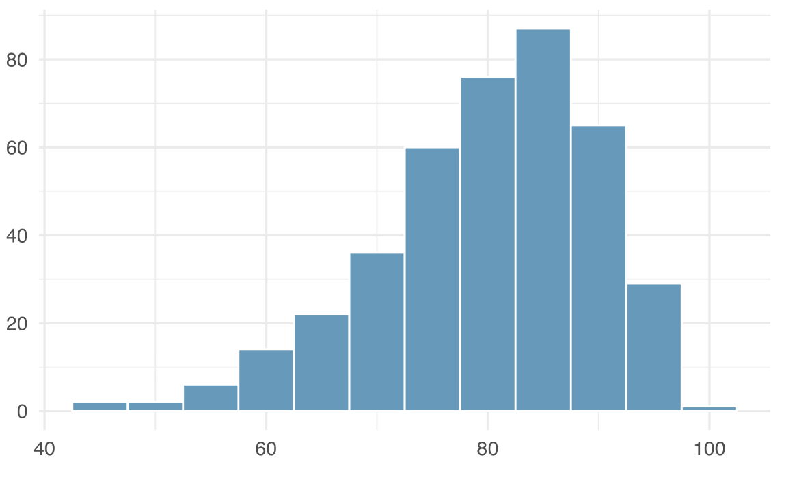

```{r global_options, include = FALSE}
library(knitr)
library(openintro)
library(tidyverse)
knitr::opts_chunk$set(eval = TRUE, results = TRUE)
```

### Instructions

+ This is the take home midterm due on Wednesday, May 8, at 5:00 pm.

+ There are 30 possible points on this assignment.

+ This midterm should take you 3-4 hours to complete. Do NOT exceed 8 hours of working on the exam. You may work on the exam at various points between now and the due date but the total time cannot exceed 8 hours. 

+ **Rules:**

  - You are allowed to use any course materials on the final. This includes the course texts, previous worksheets, and previous labs.

  - You should not be using google or any other website at any point during this exam. 
  - If you are having trouble using `R` (graphing, for example), look through old worksheets and labs for example code. You will not be asked to do anything in `R` that you have not done before. 
  - You are not permitted to speak with any one other than me about the midterm till after the due date. (Even if you finish early, don't talk to your class mates about it since they might not be finished).
  - Please attempt the exam early so that we can fix any knitting issues before the due date. Your final will not be accepted if it does not knit.

+ Answer `R` questions by writing code where you are asked to `## insert code here`
+ Answer written questions in the space provided where it says "Write your answer here".
+ All answers have a code chunk section but you may not always need to use the code chunks. 
+ **Written answers need to be in complete sentences.**
+ **You need to show your work or `R` code for any calculations.**


---

#### **TIP 1:** Don't forget to verify the conditions needed to apply our methods to any applicable problems!

#### **TIP 2:** Show lots of work and explain what you are doing in your code. I can give more partial credit if you have the right idea even if the code is not correct.

---

##### **Exercise 1. For each of the followign statements indicate if they are true or false (no explanation necessary). (2.5 points)** 

**(A.) the $p$-value is the probability of a type I error.**

**(B.) the $p$-value is a measure of how extreme the observed data is.**

**(C.) a $p$-value smaller than the significance level confirms that the null hypothesis is false.**

**(D.) If the null hypothesis is true, then the $p$-value will always be larger than the significance level.**

**(E.) A large $p$-value confirms the null hypothesis.**

<div>
:::{#answer}

(A.) 

(B.)

(C.)

(D.)

(E.)

:::
</div> 

---
 
##### **Exercise 2. It is claimed that a bag of skittles should contain $30 %$ red, $20 %$ green, $20 %$ orange, $15 %$ yellow, and $15 %$ purple. A quality control analyst wants to test if skittle bags are following this guideline. The analyst randomly selects $20$ bags each containing $50$ skittles so that they have $1000$ skittles in total. From the $1000$ skittles she finds the values in the table below.   (3 points)**

<p align="center"> **Skittles Data** </p>
| | Red | Green | Orange | Yellow | Purple |
|:--:|:--:|:--:|:--:|:--:|:--:|
| Observed | $300$ | $190$ | $185$ | $160$ | $165$ |

**(A.) State the null and alternate hypothesis being tested in this scenario**

$H_0:$

$H_A:$

**(B.) Find the p-value for the test statistic or state why our methods do not apply.**

```{r}
# insert code here
```


**(C.) Use your the p-value to from a conclusion at the $.05$ significance level. Write your conclusion within the context of the problem.**


<div>
:::{#answer}

Write your answer here

:::
</div> 

---

##### **Exercise 3. Consider the histogram shown below: (knit to view the image)   (1 points)**

<center>

</center>

**(A.) Estimate the median for the $400$ observations shown in the histogram. (hint: the bin width is 5)**

<div>
:::{#answer}

Answer here

:::
</div>

**(B.) Do you expect the mean to be larger or smaller than the median, explain your reasoning**

<div>
:::{#answer}

Answer here

:::
</div>


---

##### **Exercise 4. Save the `mammals` data from the `openintro` package locally. (2.5 points)** 

```{r}
# insert code here
```

**(A.) Plot a scatter plot that displays hours spent dreaming on the $y$-axis and total number of hours spent sleeping on the $x$-axis.**

```{r}
# insert code here
```

**(B.) Find the Pearson correlation coefficient for the two variables.**

```{r}
# insert code here
```

**(C.) Find $b_0$ and $b_1$ for a linear regression model. Explain their meaning within the context of the problem**

```{r}
# insert code here
```

<div>
:::{#answer} 

Answer here
 
:::
</div>

**(D.) Add your linear regression model to the scatter plot you produced in part (B.)**

```{r}
# insert code here
```


---

##### **Exercise 5. A poll conducted found that 52% of U.S. adults support a new policy. The standard error for this estimate was 2.4%. Assume all conditions needed to apply our methods are satisfied. Construct a $99 \%$ confidence interval for the proportion of U.S. adults that support the new policy (1 points)**

```{r}
# insert code here
```

<div>
:::{#answer} 

Answer here
 
:::
</div>

---

##### **Exercise 6. Suppose you conduct a hypothesis test with a sample size of $40$ and get a $p$-value of $0.12$. When double checking your work you realize that you made a silly mistake and the sample size was actually $400$. Will your $p$-value increase, decrease, or stay the same? Explain your reasoning. (1 point)**

<div>
:::{#answer}
Answer here
:::
</div>

---

##### **Exercise 7. From a normally distributed population with population mean $43$ a random sample of size $18$ is selected. The standard deviation of the sample is measured to be $10$. What is the probability that the sample will have a mean larger than $45$?  (2 points)**

```{r}
# insert code here
```

---

##### **Exercise 8. A medical condition exists in $4 \%$ of the population. A test for the condition has a false positive rate of $8 \%$ and a false negative rate of $1 \%$. If a person tests positive, what is the probability that they have the condition? (2 points)**

```{r}
# insert code here
```

---

##### **Exercise 9. Suppose we are doing a hypothesis test to determine if there is a statistically significant difference in two population proportions. Will we need to calculate a pooled proportion? Why or why not? (1 points)**

<div>
:::{#answer}
Answer here
:::
</div>

---

##### **Exercise 10. Suppose you roll a $8$-sided die $3$ times. Let $A$ be the event that you roll at least one $7$. (1.5 points)**

**(A.) Describe in words the event $A^c$.**

<div>
:::{#answer}
Answer here
:::
</div>

**(B.) Find $P(A^c)$.**

<div>
:::{#answer}
Answer here
:::
</div>

**(C.) Find $P(A)$.**

<div>
:::{#answer}
Answer here
:::
</div>

---

##### **Exercise 11. Consider a normally distributed population with mean $175$ and standard deviation $15$. (1.5 points)**

**(A.) What is the $z$-score for the data point $185$?**

```{r}
# insert code here
```

**(B.) In what percentile is the data point $150$?**

```{r}
# insert code here
```

**(C.) What is the probability that a random data point from the population falls between $160$ and $170$?**

```{r}
# insert code here
```

---

##### **Exercise 12. Below is data that represents self reported responses to whether people have taken action to help address climate change. Perform a hypothesis test in order to determine if there is statistically significant evidence that people taking action against climate change depends on their generation. (You can assume independence but you need to check other conditions) (3 points)**


| Generation | Took action | Didn't take action | Total |
|:--:|:--:|:--:|:--:|
| Gen Z | $292$ | $620$ | $912$ |
| Millennial | $885$ | $2275$ | $3160$ |
| Gen X  | $809$ |  $2709$ | $3518$ |
| Boomer and Older  | $1276$ | $4798$ | $6074$ |
| Total | $3262$ | $10402$ | $13664$ |

**(A.) Set up the hypotheses below :**

<div>
:::{#answer}
$H_0:$

$H_A:$
:::
</div>

**(B.) Conduct a hypothesis test to obtain a $p$-value for the sample statistic or explain why our methods do not apply.**

```{r}
# insert code here
```

**(C.) Write the conclusion from your hypothesis test within the context of the problem.**

<div>
:::{#answer}
Answer here
:::
</div>

---

##### **Exercise 13. (3 points)**

**(A.) Save the `hfi` data set from the `openintro` package locally. This data gives personal freedom scores for in a variety of different contexts for different countries in the world.**

```{r}
# insert code here
```

**(B.) There is data in `hfi` from many years, but we want to restrict to only data from the years $2014$, $2015$, and $2016$. Use `filter()` to extract the data and save the results as `hfi_2014_2016`.**

```{r}
# insert code here
```

**(C.) From this smaller set data, find the standard deviation of `pf_score` (personal freedom score) for each year (ie. answer with three numbers, one for each year). **

```{r}
# insert code here
```

**(D) Find if there is a statistically significant difference in average `pf_score` for the years $2014$, $2015$, and $2016$. Write your conclusion within the context of the problem**

```{r}
# insert code here
```

---

##### **Exercise 14. From a population with unknown population distribution we wish to compare two groups. $500$ observations from one groups yielded a mean of $18.5$ and standard deviation of $4.7$. $300$ observations from the other group yielded a mean of $18.2$ and a standard deviation of $3.8$. Does this data provide statistically significant evidence that the mean of the two groups is different? (Assume independence is satisfied) (2.5 points)**

**(A.) Set up the hypotheses below :**

<div>
:::{#answer}
$H_0:$

$H_A:$
:::
</div>

**(B.) Conduct a hypothesis test to obtain a $p$-value for the sample statistic or explain why our methods do not apply.**

```{r}
# insert code here
```

**(C.) Write the conclusion from your hypothesis test within the context of the problem.**

<div>
:::{#answer}
Answer here
:::
</div>

---

##### **Exercise 15. Load the `textbooks` data from the `openintro` package. It contains data for the price of new textbooks at the UCLA book store and on amazon. Conduct a hypothesis test to determine if there is a statistically significant difference between the prices of textbooks from the two sellers. (Assume our methods apply). (2.5 points)**

**(A.) Set up the hypotheses below :**

<div>
:::{#answer}
$H_0:$

$H_A:$
:::
</div>

**(B.) Conduct a hypothesis test to obtain a $p$-value for the sample statistic.**

```{r}
# insert code here
```

**(C.) Write the conclusion from your hypothesis test within the context of the problem.**

<div>
:::{#answer}
Answer here
:::
</div>

---

##### **Exercise 16. What is one thing you learned during this course that you believe will be helpful in your future endeavours? (1 bonus point)**

<div>
:::{#answer}
Answer here
:::
</div>
